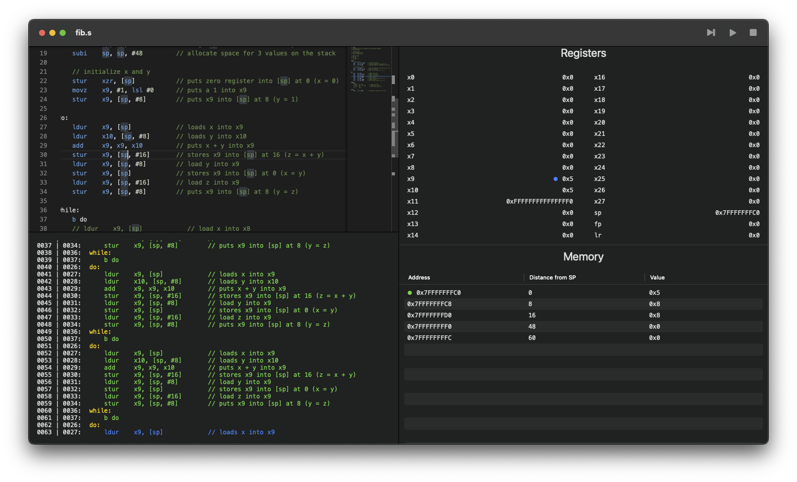

# LEGv8-Simulator
A SwiftUI application for writing, executing, and debugging LEGv8 assembly code with a series of visual tools.

:warning: This software is community made and may have errors. Use at your own risk.

# Download
Here you can download the [latest release](https://github.com/AdinAck/LEGv8-Simulator/releases/).

# Usage
## Editing text
The top left panel is the Monaco Text Editor from VSCode, it supports all the standard shortcuts and QoL features (even the command pallette).

## Execution
There are three buttons in the top right:
- Assemble - Assemble the code for execution (cmd + b)
- Step - Execute the next instruction (cmd + k)
- Run/Continue - Execute the rest of the instructions (cmd + l)
- Stop - Reset everything, go back to beginning of program (cmd + j)

## Console

Below the text editor, there is a "console" displaying a history of instructions executed, the current line of execution, the program counter and line number values for each instruction, and errors if they occur.

## Indicators

In the **Registers** and **Memory** panes, blue dots indicate the value was changed and purple dots indicate it was read.

In the **Memory** pane, the green dot indicates the position of the stack pointer and the orange dot indicates the position of the frame pointer.

## Preferences
You can access the preferences window by pressing `cmd + ,`.

Here you can configure some settings (not persistent yet) and view the about page.

# Command Line Utility
This project also contains a command line utility that executes a selected LEGv8 assembly file and dumps the state of the CPU at the end of the program to the selected file.

The execution of the file is extremely verbose and any assembly or runtime errors are displayed.

# TODO
- Line by line execution in monaco editor (hard)
- User settings
- *Build on type* is a bit laggy, perhaps make emulation async

## Unimplemented instructions
- LDURSW
- STURW
- LDURH
- STURH
- LDURB
- STURB
- LDXR
- STXR

# Known issues 🐞
## iOS
- Monaco Javascript error on start for no reason, has to do with `detectTheme` somehow.
- Plus button in file explorer errors, but "Create document" button works fine...
- 2 back buttons? Only one of them does anything.
- Keyboard does not present itself.

## macOS
- None

## Shared
- It is possible the lexer may mistakenly accept incorrectly formatted instruction arguments as comma separators are treated the same as whitespace.
- InvalidMemoryAddress error may incorrectly display the invalid address. This is a bug with printf so it is impractical for me to resolve it.

# Contributions
If you would like to contribute to the project, please contact me (see my [profile README](https://github.com/AdinAck)).