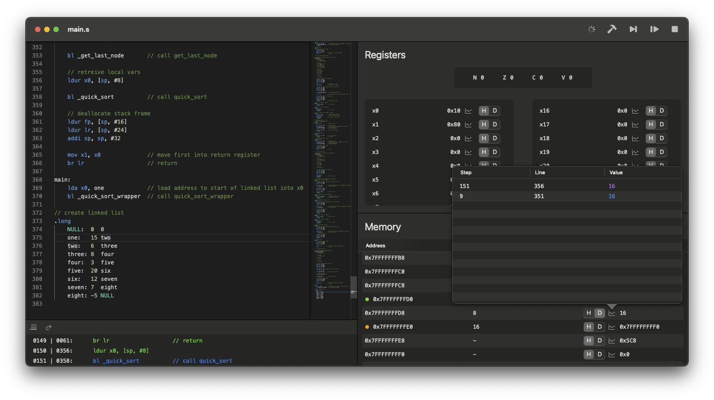

# LEGv8-Simulator
A SwiftUI application for writing, executing, and debugging LEGv8 assembly code with a series of visual tools.

:warning: This software is community made and may have errors. Use at your own risk.

# Usage
## Editing text
The top left panel is the Monaco Text Editor from VSCode, it supports all the standard shortcuts and QoL features (even the command pallette).

## Execution
There are three buttons in the top right:
- Step - Execute the next instruction (cmd + k)
- Run/Continue - Execute the rest of the instructions (cmd + l)
- Stop - Reset everything, go back to beginning of program (cmd + j)

Below the text editor, there is a "console" displaying a history of instructions executed, the current line of execution, the program counter and line number values for each instruction, and errors if the occur.

# TODO
- Customizable execution limit
- Optimize lexer and improve verbosity
- Differentiate *Assembler* and *Runtime* errors
- Display assembler errors before execution
- Register future labels before execution
- Line by line execution in monaco editor (hard)

## Unimplemented instructions
- LDURSW
- STURW
- LDURH
- STURH
- LDURB
- STURB
- LDXR
- STXR
- MOVZ
- MOVK
- CBZ
- CBNZ
- BR
- BL

# Known issues 🐞
## iOS
- Monaco Javascript error on start for no reason, has to do with `detectTheme` somehow.
- Plus button in file explorer errors, but "Create document" button works fine...
- 2 back buttons? Only one of them does anything.
- Keyboard does not present itself.

## macOS
- None

## Shared
- It is possible the lexer may mistakenly accept incorrectly formatted instruction arguments as comma separators are treated the same as whitespace.
- branching to a label in the future that has not been run before results in an error

# Contributions
If you would like to contribute to the project, please contact me (see my [profile README](https://github.com/AdinAck)).